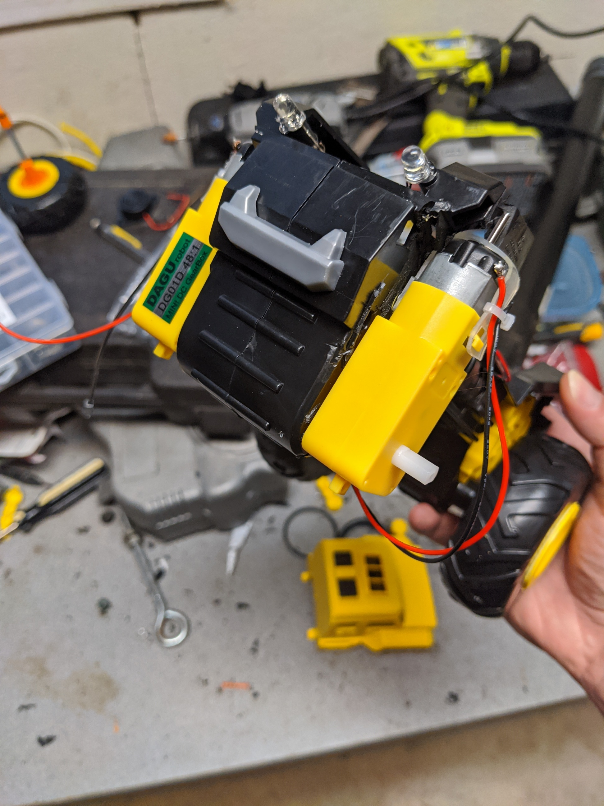

# ECE 4180 Final Project: The Bump Dumpster
#### By Christopher Jones and Brett Baxley - Fall 2021

### Github Link: https://github.com/cjones402/ECE-4180-Final-Project

For our Final Project, the team chose to take a Tonka Truck and add an RC component to it. Using the UART and robot parts from the 4180 kit, the team was able to design and create an RC dumptruck with a working dumping mechanism, a sonar distance detector, and working LED headlights while allowing for motion.


### Block Diagram and Wiring

For the project to make work, the device must be wired up. Below is a block diagram listing signals sent to each device (Note: Every device in the system shares a common ground).


All of the devices in the system get power from two 6.0 V battery packs, including the Mbed. The Mbed then sends a 3.3 V signal out to devices that need it.
Each system is highlighted below with it's wiring guide and code snippets.

#### LED Headlights

The LED Headlights are very simple to wire up. Using a 330 Ω resistor on each jumper, the LEDs are wired as follows:

| Signal      | Pin Location |
| ----------- | ----------- |
| LEDA      | P23       |
| LEDB   | P24        |
| GND   | GND        |

These are then written to by setting Digital Out Variables in the Mbed code. 
``` cpp
DigitalOut LEDA(p23);
DigitalOut LEDB(p24);
```

#### Piezo Buzzer

The Piezo Buzzer is wired as a digital out, just like the LEDs are. The wiring is as follows:

| Signal      | Pin Location |
| ----------- | ----------- |
| Speaker      | P10       |
| GND   | GND        |

To make the buzzer play sound, it does not require a tone. That means a digital out is sufficient. To change the value of the buzzer, do so by writing: 
``` cpp
DigitalOut speaker(p10);
```
Since the speaker should only play in the case of moving packwards, a ticker is used to check if the dumptruck is moving backwards. The ticker and the function setup are below:

``` cpp
Ticker audio_sampletick;

void Alert()
{
    if (!sound) {
        speaker = 0.0;
    } else {
        speaker = 1.0;
        wait(1);
        speaker = 0.0;
        wait(0.5);
    }
}
```

In main, you would then attach the ticker with the Alert function and the time interval:
```cpp
audio_sampletick.attach(&Alert,1.6);
```    

The sound boolean is set in the switch statement used for the UART. That will be examined shortly. 

#### Adafruit UART Friend - Bluetooth Module

This is the most important device in the project, since this controls whether or not the device can move through user control. Using Adafruit's UART friend and the Bluefruit Connect app, the dumptruck can be controlled from a smartphone by sending data to the Mbed using a serial interface. 

To wire this device:

| Signal      | UART  | Mbed |
| ----------- | ----------- | ----------- |
| VCC (6 V)     | Vin (UART) | |
| GND   | CTS        | GND |
| Serial RX   | TX0  | P13 |
| Serial TX   | RXI  | P14 |
| GND | GND | GND |

Once wired, a Serial object is created to receive data from the Bluefruit App. 
``` cpp
Serial blue(p13,p14);
```

Next, this data is read of the serial interface. The getc() function is used. However, getc() is blocking. The buttons used on the device are then configured to run until a new one is pressed if data is changed. In order to gather this data, multiple getc()'s are used to get the new command '!', then 'B', and the case '1' or '0' for hit or release. The code for the buttons is only using a hit. The code below includes a lot of code examined later, but shows the general flow of the program as it receives data.

``` cpp
while(1) 
{
        if (blue.getc()=='!') 
        {
            if (blue.getc()=='B') 
            { 
                bnum = blue.getc();
                if (blue.getc()=='1')
                    switch (bnum) 
                    {
                        case '1': // number button 1
                            // Stuff
                            break;
                        case '2': // number button 2
                            // Some stuff
                            break;
                        case '3': // number button 3
                            LEDA = !LEDA;
                            LEDB = !LEDB;
                            break;
                        case '4': // number button 4
                            // Some stuff
                            break;
                        case '5': // button 5 up arrow
                            // Stuff
                            break;
                        case '6': // button 6 down arrow
                            // Stuff
                            break;
                        case '7': // button 7 left arrow
                            // More stuff
                            break;
                        case '8': // button 8 right arrow
                            // Stuff
                            break;
                        default:
                            break;
                    }
                    blue.getc();
                }
            }
        }
    }
```

This code segment is very long, but it showcases how the UART is used to gather data using getc() and select each case. Next up is the H-Bridge and the 2 DC motors that drive the device.

#### H-Bridge and DC Motors
The H-Bridge is a device used to control two DC motors and allow them to go forward and reverse. The device takes a VM for the motors, control signals for both motors, and PWM signals to control both. Wiring guide for the dumptruck is below:

| Signal      | H-Bridge  | Mbed | Motor |
| ----------- | ----------- | ----------- | ----------- | 
| VCC (6 V)     | VM | | |
| Vin   | Vcc        | Vout (3.3 V) | |
| /STBY   | Logic High  | Vout | |
| PWMA   | PWMA  | P21 | | 
| PWMB   | PWMB  | P22 | |
| AIN1   | AIN1  | P5 | |
| AIN2   | AIN2  | P6 | |
| BIN1   | BIN1  | P7 | |
| BIN2   | BIN2  | P8 | | 
| AO1   | AO1  | | Motor A + Lead|
| AO2   | AO2  | | Motor A - Lead|
| BO1   | BO1  | P22 | Motor B + Lead|
| BO2   | BO2  | P22 | Motor B - Lead|
| GND | GND | GND | GND|

That is a lot of wiring for an H-Bridge. The PWM outputs are controlling the movement with an efficient PWM signal. AIN1/AIN2 and the B motor counterpart are controls for forward and reverse. 


In order to code this, you can include a special "Motor.h" header file to easily create motors and pass the values (-1 to +1) to control the speed and forward/reverse. For example, 
``` cpp
#include "Motor.h"
// Setting up left and right DC motors
Motor left_motor(p21,p5,p6);
Motor right_motor(p22,p7,p8);
```

Now, if you wanted the motors to move forward, you would write
```cpp
float forward_value = 1.0;
left_motor.speed(forward_value);
right_motor.speed(forward_value);
```
In each case statement 5 - 8, different motor speeds are used to control forwards (1.0 on both), backwards (-1.0 on both), left (1.0 on right, 0.4 on left), and right (1.0 on left, 0.4 on right). 

Below is a video of the mechanism moving forward using the H-Bridge and the Mbed.

https://user-images.githubusercontent.com/90974583/145326621-d6ce1a70-9c84-4928-a9de-dc5e759a64c1.mp4

#### Servo Motor and Dump Bed
Speaking of motors, a servo motor is used to control the dump bed of the dumptruck. A servo motor requires power, gnd, and a control signal. Wiring guide is below: 

| Signal      | Pin Location |
| ----------- | ----------- |
| 6 V      | VCC       |
| Control   | P26        |
| GND   | GND        |

The mechanism, however, for th servo on the dumptruck is not so simple. The mechanism uses a paperclip piece connected to the servo and the dumpbed using pieces of servo plastic. A hole was cut in the back of the dump truck's bed to allow for the movement up and down.


In order to code the servo, a "Servo.h" file can be used to easily control position.
```cpp
#include "Servo.h"
Servo dump(p26);
```

To control the positioning of the servo, you can set the position using an overloaded '=' operator. 
```cpp
// Setting the servo position to halfway
dump = 0.5;
```
Below is a video of the servo and dump bed working during testing.
https://user-images.githubusercontent.com/90974583/145327727-fb6ece44-bec5-4a41-a59f-6a12987fc13b.mp4

#### Sonar

With a dumptruck meant for kids, there is a very large possibility of them running it into the wall. However, the team decided they dumptruck should stop and not let the user move forward if the dumptruck is too close. The team used a sonar for this part instead of the ToF sensor, which would have been another good choice. 

However, when attempting to use a Ticker, an issue keeped popping up about the Mbed messing with the ISR. After plenty of trial and error, a final choice was made to RTOS to create a thread for the sonar. 

Wiring the Sonar: 

| Signal      | Pin Location |
| ----------- | ----------- |
| 6 V      | VCC       |
| Trig   | P28        |
| Echo | P27 | 
| GND   | GND        |

In order to create a thread, you must include "rtos.h". The library in this code is different than the normal rtos code, since it removes the "error.h" file to work with the new mbed-os. 
```cpp
// Outside the main code
#include "rtos.h"
// Inside the main() function
Thread t1(thread1);
```
When creating a thread, you pass in a function to run. Main() is one thread that runs continuously, and a second 't1' has been added. 

```cpp
void thread1(void const *args)
{
    ultrasonic mu(p28, p27, .1, 1, &dist);    //Set the trigger pin to D28 and the echo pin to D27
    //have updates every .1 seconds and a timeout after 1
    //second, and call dist when the distance changes
    mu.startUpdates();//start measuring the distance
    while(true) {
        mu.checkDistance();
    }
}
```

This function checks the distance every 0.1 seconds and calls a function 'dist' to check the distance. 

```cpp
void dist(int distance)
{
    //put code here to execute when the distance has changed
    printf("Distance %d mm\r\n", distance);
    if (distance < 200) {
        printf("Distance is less than 200");
        moveForward = false;
        left_motor.speed(0.0);
        right_motor.speed(0.0);
    } else {
        moveForward = true;
    }
}
```

If the distance is less than 200 mm, you set the motor speed to 0 and not allow forward movement. The user can then turn the dumptruck left or right, or move backwards to then move forward again. 

### Putting it All Together

After connecting the battery packs and all the devices together, the dumptruck is ready to work together. In the "main.cpp" file in this repository, the source code for the bot is available to look at. A final video of all the parts working together is below.

// TODO: VIDEO LINK GOES HERE //

Overall, this project was a fun experience and very challenging to fix design issues and debug some errors, but it came out well. 
