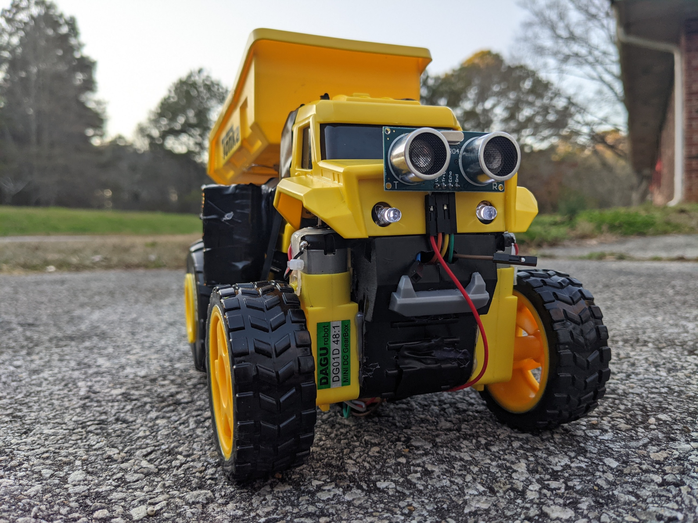
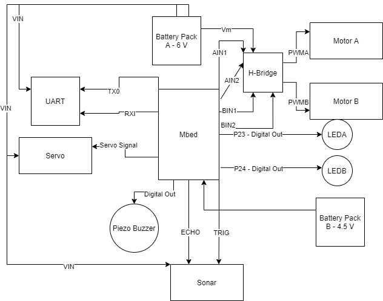

# ECE-4180-Final-Project
#### By Christopher Jones and Lucas Baxley - Fall 2021

For our Final Project, the team chose to take a Tonka Truck and add an RC component to it. Using the UART and robot parts from the 4180 kit, the team was able to design and create an RC dumptruck with a working dumping mechanism, a sonar distance detector, and working LED headlights while allowing for motion.



### Block Diagram and Wiring

For the project to make work, the device must be wired up. Below is a block diagram listing signals sent to each device (Note: Every device in the system shares a common ground).



Most of the devices in the system use the 6 V battery back. However, some of the devices additionally use the 4.5 V sent into the Mbed. These include the Piezo Buzzer and the two LED headlights.

Each system is highlighted below with it's wiring guide and code snippets.

#### LED Headlights

The LED Headlights are very simple to wire up. Using a 330 Ω resistor on each jumper, the LEDs are wired as follows:

| Signal      | Pin Location |
| ----------- | ----------- |
| LEDA      | P23       |
| LEDB   | P24        |
| GND   | GND        |

These are then written to by setting Digital Out Variables in the Mbed code. 
``` cpp
DigitalOut LEDA(p23);
DigitalOut LEDB(p24);
```


#### Piezo Buzzer

The Piezo Buzzer is wired as a digital out, just like the LEDs are. The wiring is as follows:
| Signal      | Pin Location |
| ----------- | ----------- |
| Speaker      | P10       |
| GND   | GND        |

To make the buzzer play sound, it does not require a tone. That means a digital out is sufficient. To change the value of the buzzer, do so by writing: 
``` cpp
DigitalOut speaker(p10);
```
Since the speaker should only play in the case of moving packwards, a ticker is used to check if the dumptruck is moving backwards. The ticker and the function setup are below:

``` cpp
Ticker audio_sampletick;

void Alert()
{
    if (!sound) {
        speaker = 0.0;
    } else {
        speaker = 1.0;
        wait(1);
        speaker = 0.0;
        wait(0.5);
    }
}
```
The sound boolean is set in the switch statement used for the UART. That will be examined shortly. 

#### Adafruit UART Friend - Bluetooth Module

This is the most important device in the project, since this controls whether or not the device can move through user control. Using Adafruit's UART friend and the Bluefruit Connect app, the dumptruck can be controlled from a smartphone by sending data to the Mbed using a serial interface. 

To wire this device:
| Signal      | UART  | Mbed |
| ----------- | ----------- | ----------- |
| VCC (6 V)     | Vin (UART) | |
| GND   | CTS        | GND |
| Serial RX   | TX0  | P13 |
| Serial TX   | RXI  | P14 |
| GND | GND | GND |

Once wired, a Serial object is created to receive data from the Bluefruit App. 
``` cpp
Serial blue(p13,p14);
```

Next, this data is read of the serial interface. The getc() function is used. However, getc() is blocking. The buttons used on the device are then configured to run until a new one is pressed if data is changed. In order to gather this data, multiple getc()'s are used to get the new command '!', then 'B', and the case '1' or '0' for hit or release. The code for the buttons is only using a hit. The code below includes a lot of code examined later, but shows the general flow of the program as it receives data.

``` cpp
while(1) 
{
        if (blue.getc()=='!') 
        {
            if (blue.getc()=='B') 
            { 
                bnum = blue.getc();
                if (blue.getc()=='1')
                    switch (bnum) 
                    {
                        case '1': // number button 1
                            // Stuff
                            break;
                        case '2': // number button 2
                            // Some stuff
                            break;
                        case '3': // number button 3
                            LEDA = !LEDA;
                            LEDB = !LEDB;
                            break;
                        case '4': // number button 4
                            // Some stuff
                            break;
                        case '5': // button 5 up arrow
                            // Stuff
                            break;
                        case '6': // button 6 down arrow
                            // Stuff
                            break;
                        case '7': // button 7 left arrow
                            // More stuff
                            break;
                        case '8': // button 8 right arrow
                            // Stuff
                            break;
                        default:
                            break;
                    }
                    blue.getc();
                }
            }
        }
    }
```

This code segment is very long, but it showcases how the UART is used to gather data using getc() and select each case. Next up is the H-Bridge and the 2 DC motors that drive the device.
